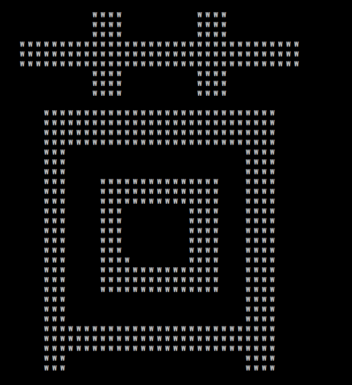

## 介绍 

`zh2emoji`可以将一个汉字，在终端输出成由emoji字符组成的该字。 emoji字符可以自己随意定制: ❤️  🐀  🐂  🐅  🐇  🐶  🐱  🐻  ...
可以将emoji替换成ASCII，或者单个汉字。

比如执行以下几行代码, 使用不同的填充方法显示来展示"茴"字:

``` python
    print(image2print(word2image(u'茴'), u'❤️ '))
    print(image2print(word2image(u'茴'), u'W '))
    print(image2print(word2image(u'茴'), u'茴', width=40))
```

其中, 对于ascii 建议后面多一个空格填充;
对于emoji, 可能跟终端的打印方式有关, 对比后自行决定后面需不需要加上空格填充;
对于汉字,输出正好占满。

输出结果如下:





更多输出:


## 扩展

基于zh2emoji，自己实现了一个可能有点儿用的扩展: `demo_show_animation.py`.

它可以将一句话在终端依次打印出来,使用你决定的emoji或者其他字符。

比如你试着执行 `python ./demo_show_animation.py 喜欢就点个赞呗`, 将在终端执行一段展示文字的动画, 展示的文字就是你刚才输入的话。

zh2emoji 还支持更换字体,不过在终端打印出来也差别不大。

## 安装

zh2emoji依赖于PIL库, 该库可通过安装Pillow引入。

    pip install Pillow==2.9.0

如果安装过程中提示错误, 可通过添加一些系统依赖来解决。

以CentOS为例:

    yum install -y libjpeg* libpng-devel libtiff-devel

上面代码会安装一些开发图片绘制相关的系统依赖。如果系统还想支持一些webp等图片格式, 那么还需要安装:

    yum install -y freetype-devel
    yum install -y libwebp-devel

## 其他

如果你对这有兴趣, 而且有一些有意思的建议, 如果我能够实现, 我会在后续中贡献出更加有趣的内容。
